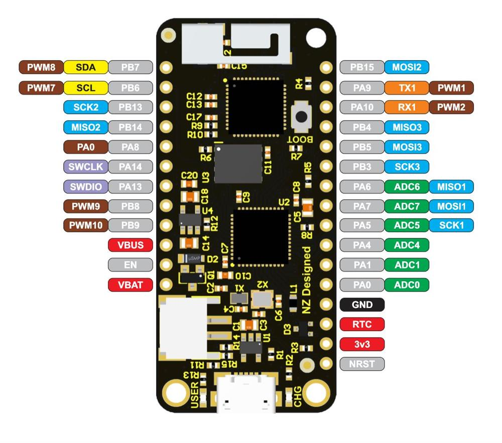

# Micropython - Before you begin

* Download micropython firmware for esp32 from: [ESP32 frimware](https://micropython.org/download/esp32/)

## ESPTool

* This tool is used to flash new firmware to esp32.
* Install it :
  
        pip install esptool

* I installed python2 version, as pip3 couldnt find python3 version of this software.
* It has wide range of functions besides just flashing firmware. Just do esptool.py --help to know more what it can do

* First erase flash:
  
        esptool.py --port /dev/ttyUSB0 erase_flash

* Flash new firmware which you just downloaded:

        esptool.py --chip esp32 --port /dev/ttyUSB0 write_flash -z 0x1000 <firmware-name>.bin

# Common tools for programming and REPL

## Ampy

* No REPL
* For file transfer

> Can run program directly from the file present in laptop (no need to send file to ESP32)
> This makes this thing useful in developing phase

    $ ampy -p /dev/ttyUSB0 run main.py

* But due to no REPL, stuffs that gets printed during running any code cannot be seen in the terminal
* Other serial communication softwares like Putty can be used for serial REPL
* But, cannot use ampy while port is busy with serial REPL

## ESPlorer

* ToDo

## Putty

* For REPL
* For serial Communication
  
## Picocom

## Rshell

* Both REPL and file transfer

## Web-REPl

> If there is infinite looping in boot.py or main.py then, this might not work

* As soon as esp32 restarts, it runs boot.py, then main.py and if it gets stuck in while(1) loop, we cannot access to web REPL
* To avoid this, keep delay, enough to log in just after webrepl.start()
* And connect the web REPL within this time

# Pin Configuration

* The board I have used was **Adafruit HUZZAH32 - ESP32 Feather**. Its pin configuration is shown below.
* Everything you need to know about this board: [Adafruit HUZZAH32 - ESP32 Feather](https://learn.adafruit.com/adafruit-huzzah32-esp32-feather/overview)

* Other **nodeMCU** boards will have slightly different configuration.
* In Feather, PIN13 is connected to onboard LED

# Power Management

* To do list
* In feather, we can just connect a battery which will run only when no power and even charges the battery with 200mA when power is available
* How cool is that !!!

# Multi-threading

* To-Do list

# Error debugging

* Always and always keep and led which will glow when 'wlan.isconnected()' is true. (Not Tested Yet)
* Update this as frequent as possible
* MY major problem was being unable to connect to internet without any reason, when ypu run same code again and again, sometimes it is not being connected
* hard to debug without any good indicator
  
# Others

* https://github.com/scientifichackers/ampy/issues/13

