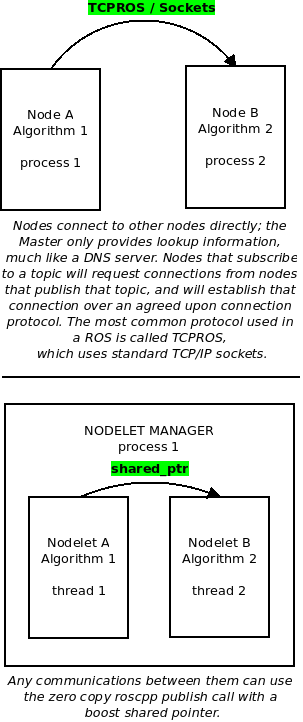

# Node Vs Nodelet

* Regular nodes share data by passing messages over TCP.
* Nodelets share data by sharing a pointer to a block of memory.
* So, for a regular node, you've got to collect all the data, pack it into a ROS form, and then write the entire data packet, and then the receiver has to read the thing and unpack it.
* Nodelets only work where there is memory to be shared **(i.e., the same physical machine)**, so you can't use them for networked devices.
* You could have something like a laser scanner, which produces a breathtaking amount of data, connected via nodelet to a process that extracts something of meaning from that data. The extraction process could then be connected via a regular node to some networked device and pass only the important results from the scan data analysis.

    

 

# Inline topic remapping

    rosbag play --clock sev_2017-02-20-15-20-50.bag /stereo/left/image_raw/compressed:=/stereo_camera/left/image_raw_throttle/compressed stereo/right/image_raw/compressed:=/stereo_camera/right/image_raw_throttle/compressed /stereo/left/camera_info:=/stereo_camera/leftcamera_info_throttle /stereo/right/camera_info:=/stereo_camera/right/camera_info_throttle