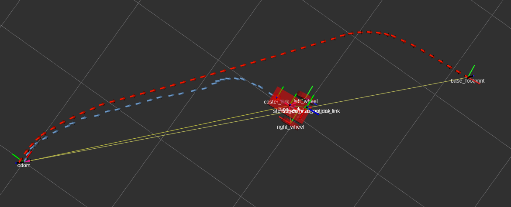
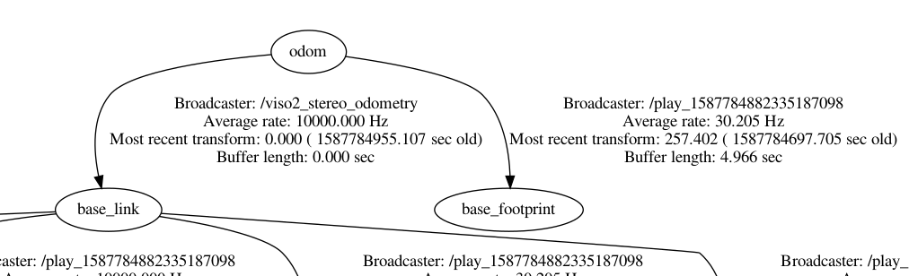
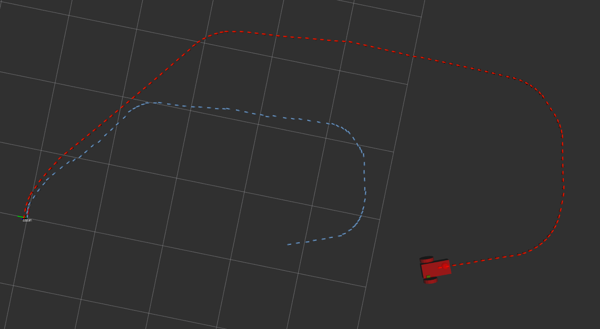
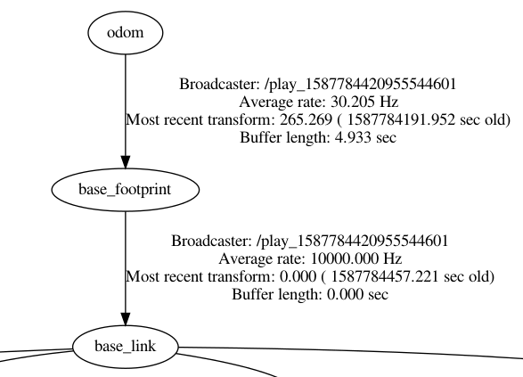

# 'viso2_ros' package

* See: [viso2](http://wiki.ros.org/viso2_ros)
* Function: Estimate camera motion based on incoming rectified images from calibrated cameras
* Has 3 nodes:
    * mono_odometer
    * mono_odometer_omnidirectional
    * stereo_odometer 
* To estimate the scale of the motion, the mono odometer uses the ground plane and therefore needs information about the camera's z-coordinate and its pitch.
* Stereo odometer just needs stereo images.
* For this to work, it needs to know:  
        base_link → camera
* If not published, it assumes it as the identity matrix which means the robot frame and the camera frame are identical

# Tf setup

* Tf tree structure needed:  
        world → odom → base_link → camera

> Well Looks like VISO2 don't use base_footprint as its root link  
> VISO2 is preety old and back then, base_link was used as root link  

* To change this to base_footprint:

    <param name="base_link_frame_id" type="string" value="/base_footprint"/>

* This package publishes:  
        odom → base_link

## 'publish_tf' param

* Consider root_link is default i.e base_link.

### If set to 1

    <param name="publish_tf"  type="bool" value="1"/> (1 by default)

* odom → base_link is published and overwrite any other odom → base_link transformations.
* So, robot will be attached to viso2 odometry but base_footprint will move as per cmd_vel
* In picture below: RED = Wheel Odom, Blue = VISO2 Odom

### If set to 0

    <param name="publish_tf"  type="bool" value="0"/>

* odom → base_link is not published

# Extras

* Uses **dense** stereo point clouds coming from stereo_image_proc
* using in Empty env wonk work hola ni aba

